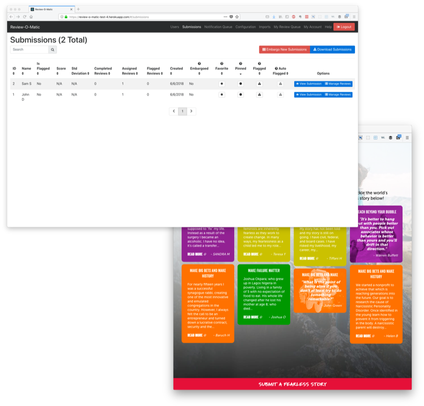

# Review-O-Matic

## About

The Review-O-Matic is a tool developed by the Case Foundation to handle the job of collecting and vetting user-submitted content. The system collects submissions via direct input or via an import from another service such as Wufoo. Once in the Review-O-Matic, the newly submitted content goes to a user for review. That reviewer grades and categorizes the content based on customizable prompts. Administrators can then explore the reviewed (and unreviewed) stories as part of a final vetting process.

### Other Features

* Public feed of approved stories
* Administrators and reviewers can manually flag inappropriate stories
* The system will also automatically flag submitted content if it contains bad language
* Ability to set "embargo" schedules where new content is held from the public for a period such as over nights and weekends
* CSV export of all submitted stories
* Ability to reassign reviews
* Designed for customization

## Installation

See [Installation](doc/Installation.md)

## End User Guide

1. [Getting Started](doc/Getting%20Started.md)
1. [Global Settings](doc/Configuration.md)
1. [Managing Users](doc/Managing%20Users.md)
1. [Creating Submissions](doc/Creating%20Submissions.md)
1. [Managing Submissions](doc/Managing%20Submissions.md)
1. [Reviewing Submissions](doc/Reviewing%20Submissions.md)

## Development

See [Development](doc/Development.md)

## Contributing

See [Contributing](Contributing.md) for additional information.

## License

See [License](License.txt) for additional information.

---

Are you using part or all of this code we've shared? We'd love to hear about it! Email us at [opensource@casefoundation.org](mailto:opensource@casefoundation.org) and tell us about how you're using this open source project.
