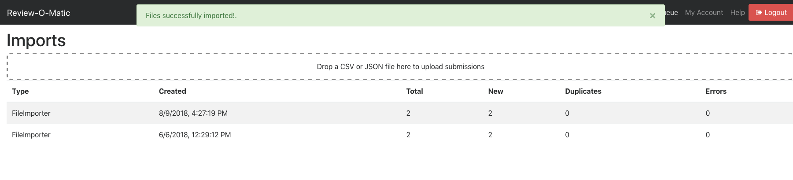
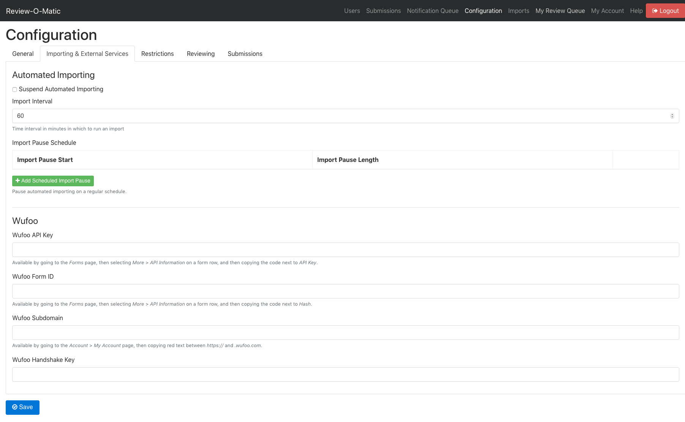

# Creating Submissions

There are three ways to create new submissions for review. The first is via importing them from a spreadsheet, the second is by connecting to a Wufoo Forms account, and the third is by submitting to the API. Each method automatically detects the types of data submitted, so there is no need to setup or configure custom fields for each type of submission.

# Importing from a Spreadsheet

1. To import via a spreadsheet, setup a document in Excel or another spreadsheet applicaiton that has a title for each column and one entry per row. (See the [example](example.csv)). 
1. When ready to import it, go to _Imports_ in the navbar of your Review-O-Matic instance. 
1. Drag the CSV file into the import area, indicated by the dotted line, or click that area and drive to the file.
1. Upon import, Review-O-Matic will analyze the CSV data to automatically determine the submission fields.
1. The _Imports_ screen will update with details on the number of new or updated imports as well as provide information about any errors.

# Wufoo Integration

1. To connect to a Wufoo account, obtain an API key, Form ID, and Wufoo Subdomain.
  1. **API Key:** go to the Forms page in Wufoo, then select More > API Information on the desired form row, and then copy the code next to API Key.
  1. **Form ID:** go to the Forms page in Wufoo, then select More > API Information on the desired form row, and then copy the code next to Hash.
  1. **Subdomain:** go to the Account > My Account page, then copy red text between https:// and .wufoo.com.
1. Enter the obtained information in the form on the _Configuration_ page under the tab _Importing & External Services_.
1. Adjust the _Import Interval_ setting to the desired number of minutes to pause between checking Wufoo for new data.
1. Review-O-Matic will then begin polling Wufoo for new form data. Upon import, Review-O-Matic will analyze the data to automatically determine the submission fields.

# API

1. Go to the _Configuration_ page, and under the _Submissions_ tab, enable "Allow public write access to submissions".
1. The site now accepts `PUT` requests with a JSON or URL encoded body of submission data to `/api/submission/public`. (One submission per request.)
1. Review-O-Matic automatically parses the data in the request body to automatically determine the submission fields.
1. To allow a Cross-origin-request from another form, add the hostname where the form lives to the field "Cross-origin-request allowed domains (One per line)".
