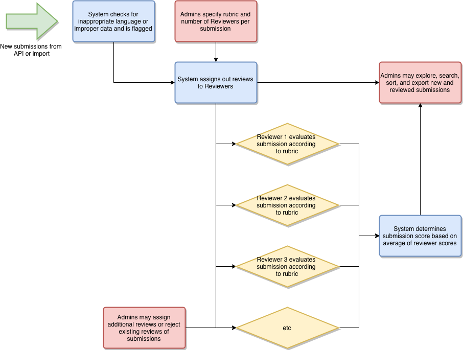

# Getting Started

Review-O-Matic is a submission review tool. It works by accepting a submission for review, checking its data for issues, and then assigning to a set number of Reviewers. Those Reviewers then evaluate the submission based on a configurable rubric. Review-O-Matic then determines each submission's score based on an average of each Reviewer's evaluation. Review-O-Matic accepts submissions in a variety of formats, and administrators have full control to examine and seach submissions, manage and reassign reviews, and import/export data.

## Workflow

The following workflow describes how submissions flow through Review-O-Matic from new data to reviewed submissions.

## Table of Contents

1. [Configuration](Configuration.md)
1. [Managing Users](Managing%20Users.md)
1. [Creating Submissions](Creating%20Submissions.md)
1. [Managing Submissions](Managing%20Submissions.md)
1. [Reviewing Submissions](Reviewing%20Submissions.md)
