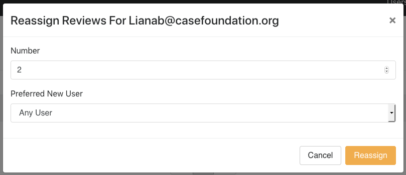

# User Management

Review-O-Matic starts with one admin user that is set via the [Environment Variables](Environment%20Variables.md). (During startup, the database is checked for users. If it is empty, the first user is created.) After that initial user, administrators may create additional users using the site's web interface.

## Creating Users

1. Go to _Users_ in the main navigation, and then select _Add User Profile_.
1. Specify an email address for the new user.
1. Specify the new user's role as Admin or User.
   1. Users may:
      1. Access their review queue
      1. View the help page
      1. Update their account preferences
   1. Admins may:
      1. Perform all User functions
      1. Manage users
      1. View all submissions and manage submissions
      1. Assign and reassign reviews
      1. Control sitewide configuration
      1. Import and export submissions
      1. Suspend importing
1. If the user should be allowed to immediately log in, leave _Active_ selected.
1. _Review Queue is Open_ permits new submissions to be assigned to the user. This configuration is useful for administrative users who need accounts to manage submissions but who will not be performing any actual reviews.
1. _Email Notification Preferences_ controls what notifications the user receives:
   1. When _Review(s) Assigned to Me_ is enabled, the user receives an email every time a review or a block of reviews is assigned to them.
   1. When _Submission(s) Added_ (Admin only) is enabled, the user receives an email every time a new submission or block of submissions comes in.

## Managing User Accounts

On the _Users_ page, there is a table of all users in the system along with the following details for the user:

1. **Pending Reviews** is the number of reviews the user has to complete at the moment.
1. **Completed Reviews** is the number of reviews the user has performed.
1. **Average Score Given** is the average score the user has assigned.
1. **Active** is whether or not the user may log in and be assigned reviews.
1. **Review Queue is Open** is whether or not the user may be assigned reviews (but may still log in if **Active** is true).
1. **Role** is the user's role. (Admin or User).
1. **Created** is when the user was created.
1. **Options:**
   1. Clicking _Edit User Profile_ launches a user editor screen that looks similar to the user setup screen.
   1. Clicking _Reassign Reviews_ launches a modal window that allows for the reassignment of the user's pending reviews. See the next section for more details.

## Managing User Review Queues

1. Should there be a need to reassign a user's incomplete (pending) reviews, go to _Users_ and select _Reassign Reviews_ for the user.
1. In the modal window, specify how many reviews to reassign. By default, the number set is the user's total number of reviews.
1. To reassign the user's reviews to another specific user, specify that user in the _Preferred New User_ dropdown. If no user is selected, the system will evenly distribute the specified number of reviews to all other users who are active and whose review queues are set to open.

---

For more documentation, visit the [Getting Started](Getting%20Started.md) guide.
